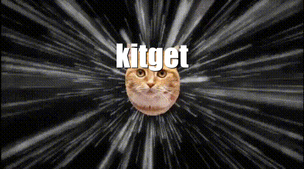
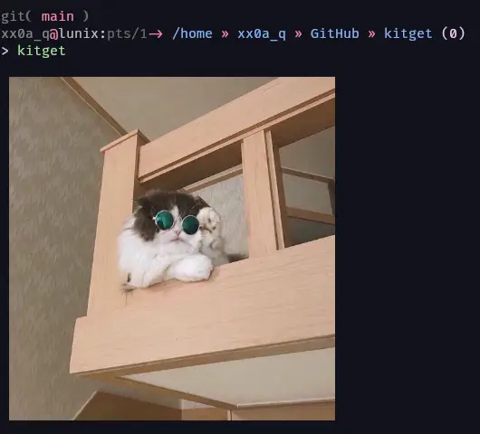
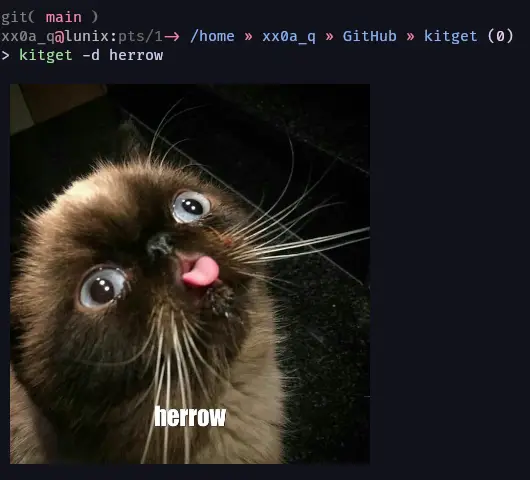
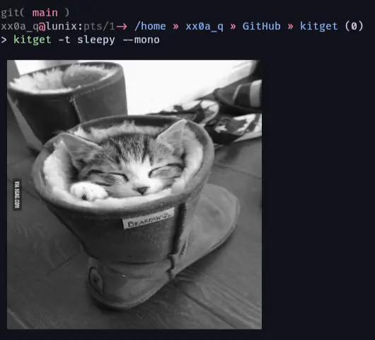
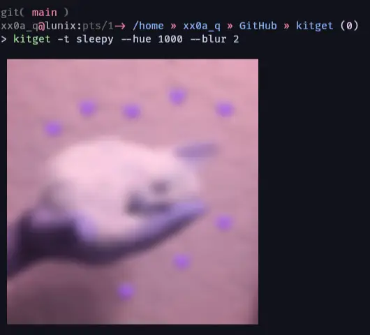

# kitget

Display and customize cat images in your terminal :3

## Usage

|                                   |                                   |
|:----------------------------------|:----------------------------------|
|  |  |
|  |  |

## Thanks to

- [Kevin Balicot](https://buymeacoffee.com/kevinbalicot) for the [Cat as a service API][cataas] (go give him money)
- [Sebaguardian](https://github.com/Sebaguardian) for mental support

[cataas]: https://cataas.com
